# PM Schedule

**PM Schedule** is a free, open-source mobile application giving students of the Maritime University of Szczecin (_Politechnika Morska w Szczecinie_) easy access to their class schedules — no login, no paywall, no subscription. Built by students, for students.


---

## Screenshots

### iOS

<table>
  <tr>
    <td>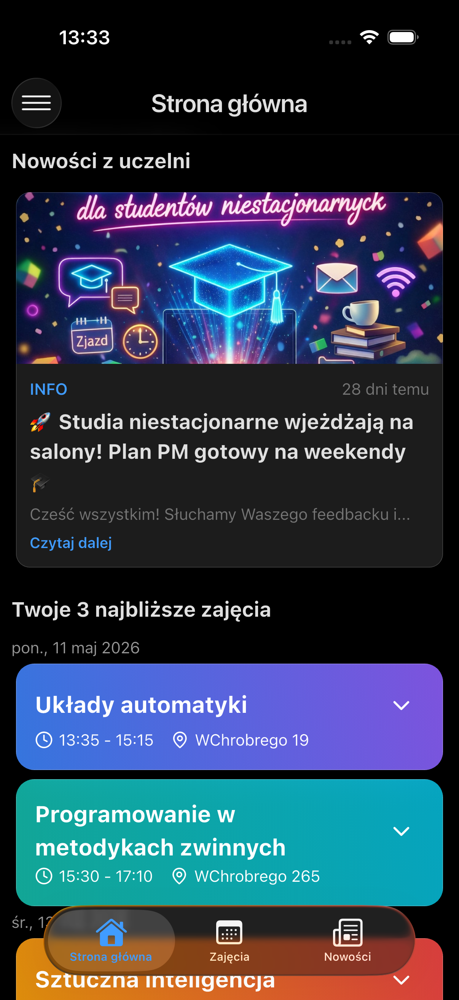</td>
    <td>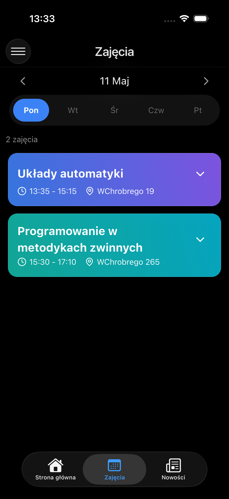</td>
    <td>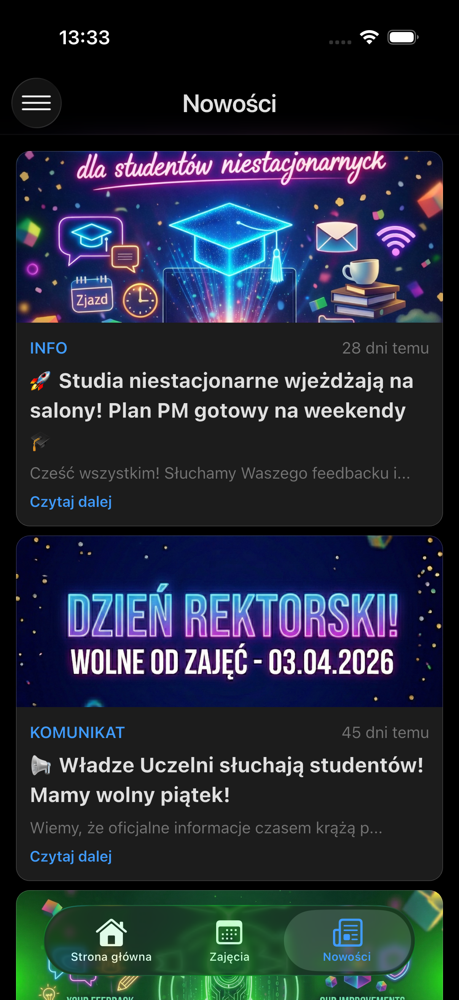</td>
    <td>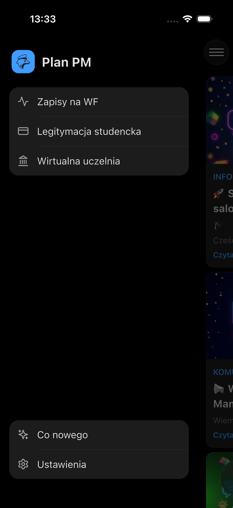</td>
  </tr>
  <tr>
    <td>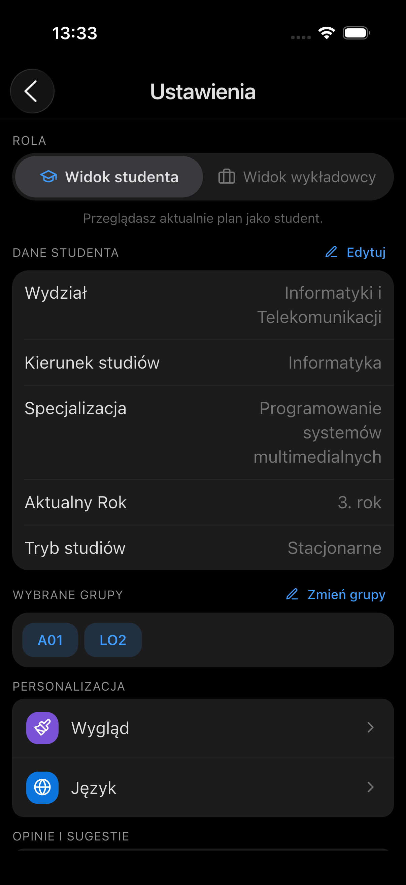</td>
    <td>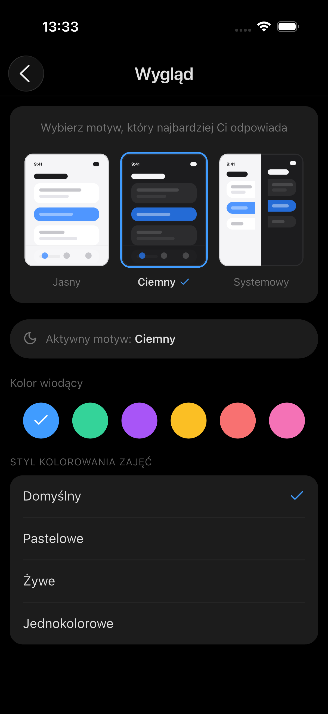</td>
    <td>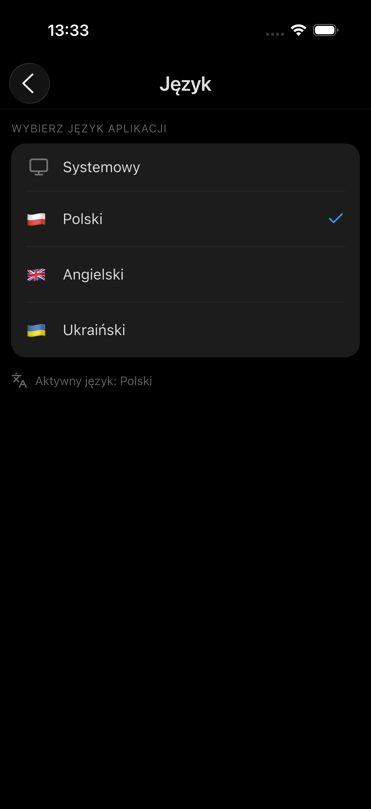</td>
    <td>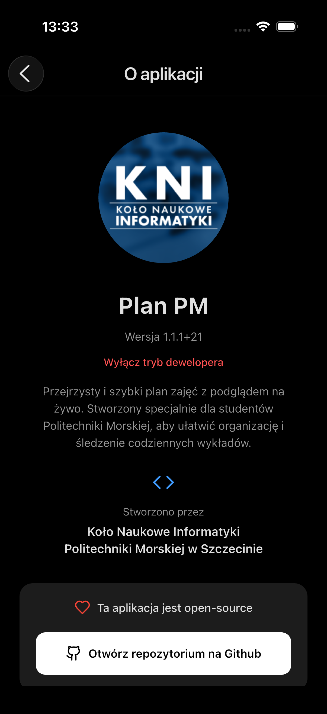</td>
  </tr>
</table>

### Android

<table>
  <tr>
    <td>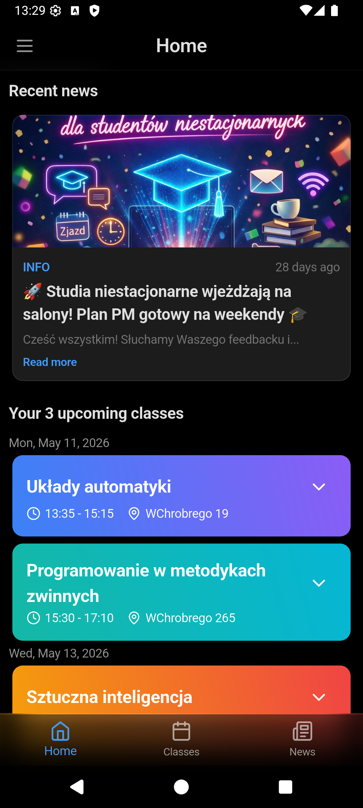</td>
    <td>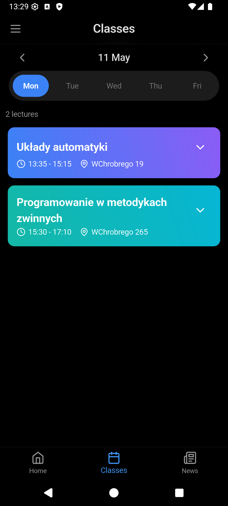</td>
    <td>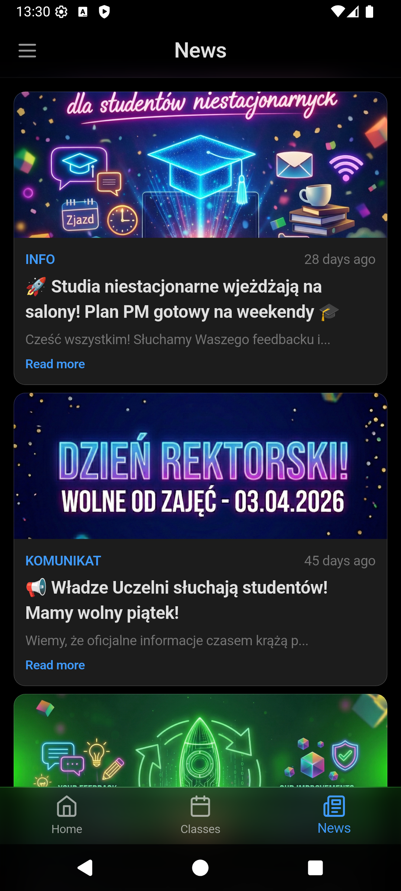</td>
    <td>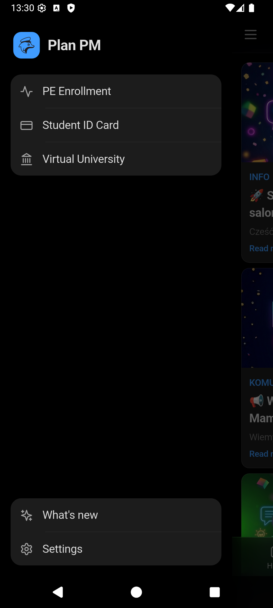</td>
  </tr>
  <tr>
    <td>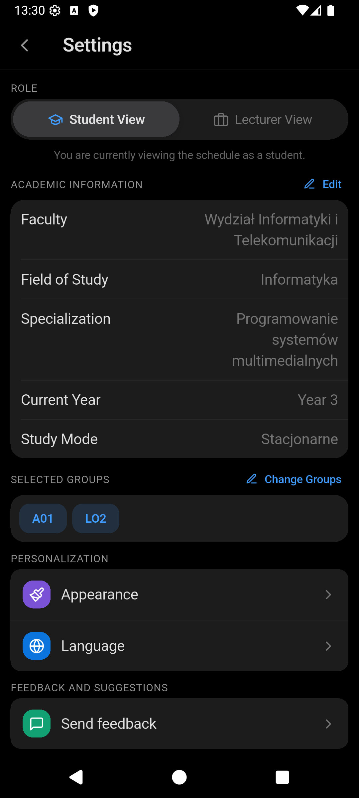</td>
    <td>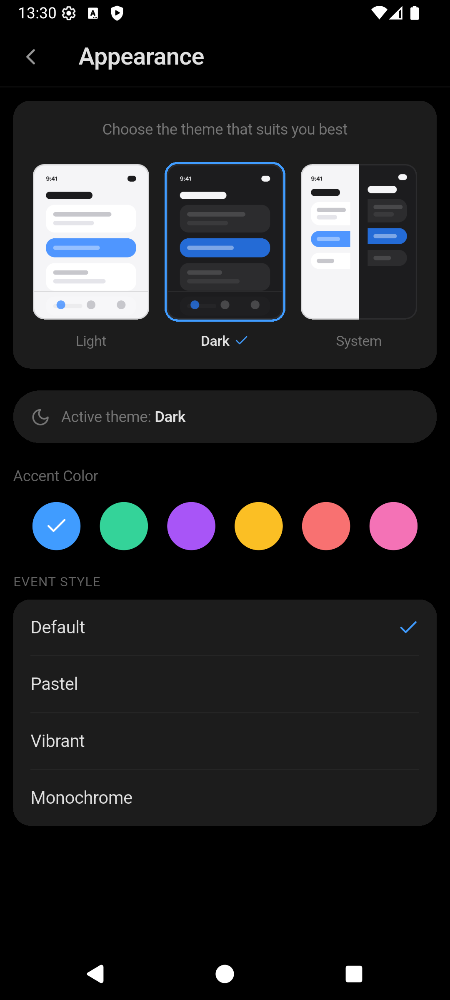</td>
    <td>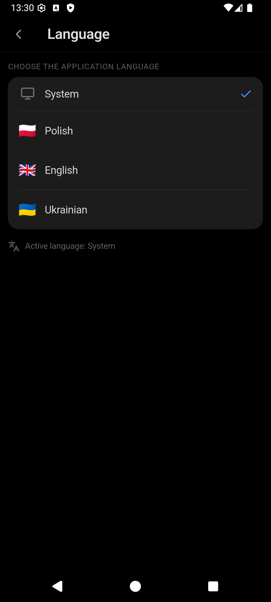</td>
    <td>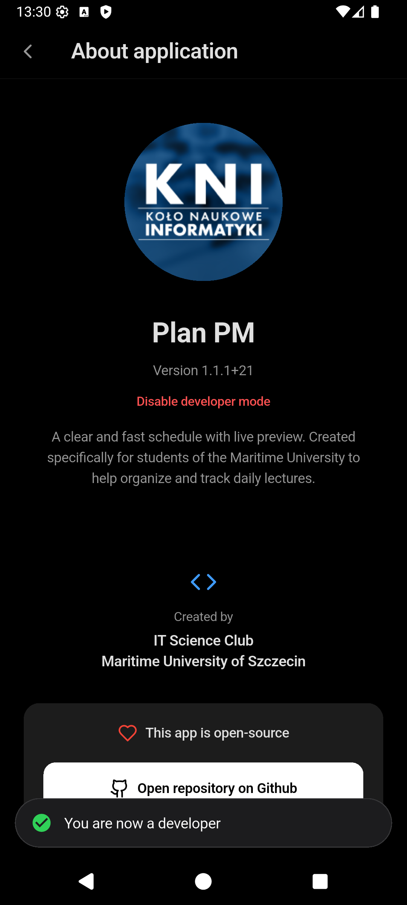</td>
  </tr>
  <tr>
    <td>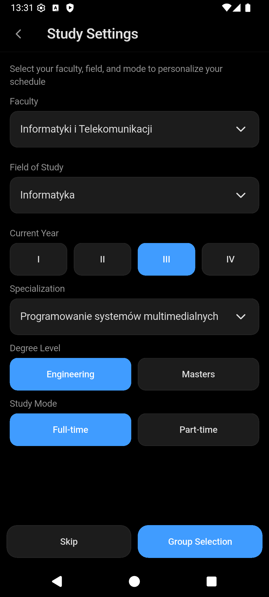</td>
    <td>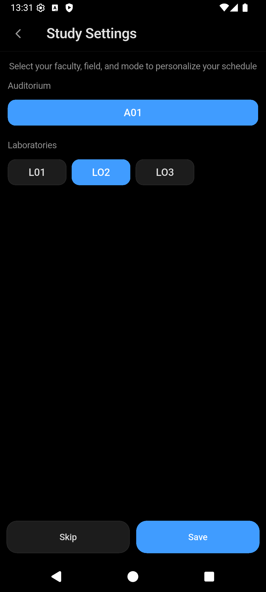</td>
    <td></td>
    <td></td>
  </tr>
</table>

---

## Features

**Currently available**

- View class schedules filtered by your degree programme (daily and weekly views)
- Lecturer mode — browse your own teaching schedule
- News feed with university announcements
- Native home screen widgets (iOS WidgetKit + Android, three sizes)
- Three languages (Polish, English, Ukrainian), light/dark themes, accent colors

**Planned**

- Push notifications for schedule changes and announcements
- Campus map and navigation
- Grades and academic progress
- Integration with university communication systems
- Secure login with university credentials

---

## Project Structure

The project is split into two parts:

### Frontend — [`frontend/`](frontend/)

A Flutter application targeting Android and iOS. Fetches schedule data from Supabase and presents it in a clean, fast mobile UI.

**Tech:** Flutter (Dart), Supabase client

### Backend — [`backend/`](backend/)

A Python data pipeline that scrapes the university's Virtual Dean's Office website and loads the data into a Supabase database. Also includes a lightweight admin tool for managing in-app news posts.

**Pipeline:**

```
Mapper → Scrapper → Parser → json2db
```

| Step        | What it does                                                        |
| ----------- | ------------------------------------------------------------------- |
| `mapper/`   | Discovers active schedule IDs via HTTP                              |
| `scrapper/` | Scrapes each schedule page via HTTP POST                            |
| `parser/`   | Normalises raw data, deduplicates, extracts teachers/rooms/subjects |
| `json2db/`  | Upserts everything into Supabase                                    |

A separate `structure_updater/` pipeline keeps the university hierarchy (Faculties → Degree Courses → Specialisations) up to date.

The `admin/` package is a local Flask admin panel (news management, pipeline runner with live logs, store stats, environment switching), and `mcp_server/` exposes the backend as MCP tools for AI agents.

**Tech:** Python, BeautifulSoup, Flask, Supabase (PostgreSQL + Storage)

For full backend documentation see [`backend/README.md`](backend/README.md) and the root [`CLAUDE.md`](CLAUDE.md).

---

## Database Access

If you need access to the Supabase project, reach out on Discord: **schoji**

---

## Contributing

Contributions are welcome — bug reports, feature requests, pull requests, translations, everything. This project belongs to the community.

Open an issue or a PR and let's talk.

---

## License

This project is licensed under the **Creative Commons Attribution-NonCommercial 4.0 International (CC BY-NC 4.0)** license.

**In plain words:**

- You are free to use, share, and adapt this project
- You must give appropriate credit to the original authors
- **Commercial use is not permitted**
- This project is and will always remain free — no paywalls, no subscriptions, no monetisation

See the full license at [creativecommons.org/licenses/by-nc/4.0](https://creativecommons.org/licenses/by-nc/4.0/).

---

_From students, for students. Free forever._
